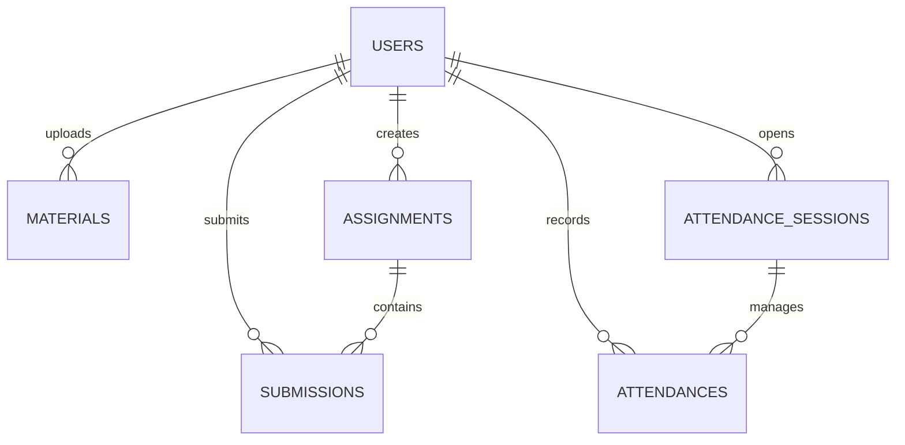
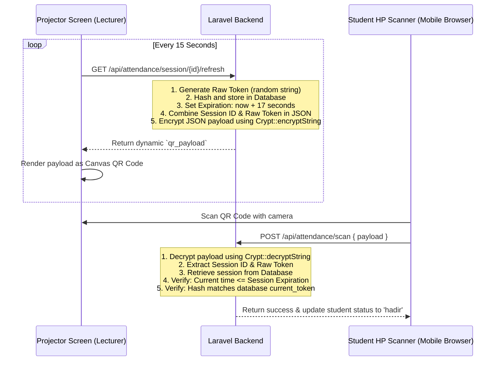

# KelasLMS Backend API Documentation

This document provides a comprehensive technical overview of the decoupled Laravel REST API backend for the **KelasLMS** platform. The backend handles authentication, course materials, assignment submissions, grading, and the time-based encrypted QR attendance flow.

---

## 1. Directory Structure

Below is the layout of the key application components in the `backend/` directory:

```plaintext
app/
├── Http/
│   ├── Controllers/
│   │   ├── AuthController.php          # Session state, login, and logout
│   │   ├── MaterialController.php      # Course materials storage & streaming
│   │   ├── AssignmentController.php    # Assignments and submissions grading
│   │   └── AttendanceController.php    # Time-based QR rotation & scanning
│   └── Middleware/
│       ├── EnsureUserIsLecturer.php    # Protects routes strictly for lecturers
│       └── EnsureUserIsStudent.php     # Protects routes strictly for students
└── Models/
    ├── User.php                        # User attributes, roles, and password hashing
    ├── Material.php                    # Course documents metadata
    ├── Assignment.php                  # Lecturer task instructions & deadlines
    ├── Submission.php                  # Student task uploads & grade records
    ├── AttendanceSession.php           # Active class sessions with current QR token
    └── Attendance.php                  # Single student presence log entry
```

---

## 2. Database Schema & Models

The system is designed with a relational schema utilizing Eloquent models with modern PHP 8 attributes.



### Models & Attributes

1. **User (`App\Models\User`)**
   - **Attributes**: `id`, `name`, `email`, `password` (hashed), `role` (`dosen` | `mahasiswa`), `nim_nip`, `remember_token`, `created_at`, `updated_at`.
   - **Casts**: `password` mapped as `hashed`, enabling automatic model-level encryption.

2. **Material (`App\Models\Material`)**
   - **Attributes**: `id`, `user_id`, `title`, `description`, `file_path`, `file_type`, `created_at`, `updated_at`.
   - **Relations**: `belongsTo(User)` (the lecturer who published it).

3. **Assignment (`App\Models\Assignment`)**
   - **Attributes**: `id`, `user_id`, `title`, `instructions`, `attachment_path`, `deadline_at` (datetime), `created_at`, `updated_at`.
   - **Relations**: `belongsTo(User)` (lecturer), `hasMany(Submission)`.

4. **Submission (`App\Models\Submission`)**
   - **Attributes**: `id`, `assignment_id`, `user_id`, `student_notes`, `file_path`, `grade` (integer, 0-100), `lecturer_feedback`, `submitted_at` (datetime), `created_at`, `updated_at`.
   - **Relations**: `belongsTo(User)` (student), `belongsTo(Assignment)`.

5. **AttendanceSession (`App\Models\AttendanceSession`)**
   - **Attributes**: `id`, `user_id`, `meeting_number` (1-16), `topic`, `current_token` (hashed), `expires_at` (datetime), `is_active` (boolean), `created_at`, `updated_at`.
   - **Relations**: `belongsTo(User)` (lecturer), `hasMany(Attendance)`.

6. **Attendance (`App\Models\Attendance`)**
   - **Attributes**: `id`, `attendance_session_id`, `user_id`, `status` (`hadir` | `sakit` | `izin` | `alpa`), `scanned_at` (datetime), `notes` (nullable override notes), `created_at`, `updated_at`.
   - **Relations**: `belongsTo(User)` (student), `belongsTo(AttendanceSession)`.

---

## 3. API Routing Reference

All API routes are defined under `routes/api.php` and carry the `/api` URL prefix. Protected routes enforce Sanctum cookie authentication.

| Method | Endpoint | Controller Action | Middleware | Description |
| :--- | :--- | :--- | :--- | :--- |
| **POST** | `/api/login` | `AuthController@login` | *None* | Authenticates credentials and issues stateful cookie |
| **POST** | `/api/logout` | `AuthController@logout` | `auth:sanctum` | Invalidates the session cookie |
| **GET** | `/api/user` | `AuthController@me` | `auth:sanctum` | Retrieves the currently authenticated profile |
| **GET** | `/api/materials` | `MaterialController@index` | `auth:sanctum` | Lists all uploaded course materials |
| **GET** | `/api/materials/{id}/download` | `MaterialController@download` | `auth:sanctum` | Secures direct file stream download |
| **POST** | `/api/materials` | `MaterialController@store` | `auth:sanctum`, `dosen` | Uploads new material (Lecturer only) |
| **DELETE**| `/api/materials/{id}` | `MaterialController@destroy` | `auth:sanctum`, `dosen` | Deletes course material and its private file (Lecturer only) |
| **GET** | `/api/assignments` | `AssignmentController@index` | `auth:sanctum` | Lists assignments (scoped by student submissions) |
| **GET** | `/api/assignments/{id}` | `AssignmentController@show` | `auth:sanctum` | Detailed assignment info (plus grading list for Lecturers) |
| **GET** | `/api/assignments/{id}/download`| `AssignmentController@downloadAttachment`| `auth:sanctum` | Download lecturer assignment attachment file |
| **POST** | `/api/assignments` | `AssignmentController@store` | `auth:sanctum`, `dosen` | Publishes a new assignment (Lecturer only) |
| **GET** | `/api/submissions/{id}/download`| `AssignmentController@downloadSubmission`| `auth:sanctum`, `dosen` | Download student submitted file (Lecturer only) |
| **POST** | `/api/submissions/{id}/grade` | `AssignmentController@grade` | `auth:sanctum`, `dosen` | Records student grade and feedback (Lecturer only) |
| **POST** | `/api/assignments/{id}/submit` | `AssignmentController@submit` | `auth:sanctum`, `mahasiswa`| Submits student file before deadline (Student only) |
| **GET** | `/api/attendance/session` | `AttendanceController@indexSessions`| `auth:sanctum` | Lists all class meetings sessions |
| **GET** | `/api/attendance/session/{id}` | `AttendanceController@showSessionDetails`| `auth:sanctum`| Detailed attendance log for a session |
| **POST** | `/api/attendance/session` | `AttendanceController@createSession`| `auth:sanctum`, `dosen` | Creates session & auto-seeds students to `alpa` (Lecturer only) |
| **GET** | `/api/attendance/session/{id}/refresh`| `AttendanceController@refreshToken`| `auth:sanctum`, `dosen` | Generates a new 15s rotating dynamic QR token (Lecturer only) |
| **POST** | `/api/attendance/session/{id}/toggle`| `AttendanceController@toggleSession`| `auth:sanctum`, `dosen` | Opens or closes an attendance session (Lecturer only) |
| **POST** | `/api/attendance/{id}/manual` | `AttendanceController@updateAttendanceStatus`| `auth:sanctum`, `dosen` | Overrides a student's status manually (Lecturer only) |
| **POST** | `/api/attendance/scan` | `AttendanceController@scanQR` | `auth:sanctum`, `mahasiswa`| Processes scanned token and logs presence (Student only) |

---

## 4. Key Architectural Implementations

### A. Stateful Session Cookie Authentication
- **Sanctum Configuration**: Stateful session authentication is implemented in headless mode. The backend shares same-domain session states via HTTP-Only, SameSite-Lax cookies without sending token authorization headers.
- **CSRF Protection Isolation**: To prevent browser cross-port cookie sandboxing issues in decoupled multi-host developments, CSRF verification is bypassed on `/api/*` routes in `bootstrap/app.php` using `$middleware->preventRequestForgery()`. Security is maintained via CORS `allowed_origins` constraints and rigid API request structures.

### B. Secure File Operations
All uploaded materials, assignment attachments, and student submissions are kept secure in private, non-public storage paths (`storage/app/private/*`).
- File access is guarded by controller actions checking roles and assignments.
- Files are streamed to authenticated users using `Storage::download()`, ensuring the real file paths are never exposed.

### C. Cryptography-Driven Anti-Fraud QR Attendance
The attendance system prevents proxy attendance (students sharing links/screenshots outside the classroom) by rotating tokens.



- **Rotation Time**: 15 seconds.
- **Expiration Limit**: 17 seconds (providing a 2-second network latency buffer).
- **Security Primitives**:
  - `Crypt::encryptString()` (AES-256-CBC via OpenSSL) generates the encrypted QR payload, preventing client-side tampered token synthesis.
  - `Hash::make()` and `Hash::check()` (bcrypt) secure the active token on the database.

### D. Performance and N+1 Query Optimization
To prevent N+1 queries when fetching relational structures, eager loading is utilized across all core fetch actions:
- **Materials**: `Material::with('user:id,name')` eager loads the author details.
- **Assignments**: Scopes submissions by role. For students, it eager loads only their own submissions using a closure filter. For lecturers, `withCount('submissions')` compiles statistics.
- **Attendance**: `AttendanceSession::load('attendances.user:id,name,nim_nip')` maps student profiles and presence logs with a single database call.

---

## 5. Security & Authorization Middlewares

Two custom authorization middlewares handle role-based restriction boundaries:

1. **`EnsureUserIsLecturer` (alias: `dosen`)**
   - Asserts that the authenticated request carries a `user` with a `role === 'dosen'`.
   - Returns a `403 Forbidden` response: `{"message": "Akses ditolak. Peran Anda bukan dosen."}` if criteria are not met.

2. **`EnsureUserIsStudent` (alias: `mahasiswa`)**
   - Asserts that the authenticated request carries a `user` with a `role === 'mahasiswa'`.
   - Returns a `403 Forbidden` response: `{"message": "Akses ditolak. Peran Anda bukan mahasiswa."}` if criteria are not met.

---

## 6. How to Run & Database Utilities

### Seeded Credentials
Run `php artisan db:seed` to populate these profiles:
- **Lecturer (Dosen)**: `budi@kelaslms.com` with NIP `198001012005011001` (Password: `password123`).
- **Student (Mahasiswa)**: `fajri@kelaslms.com` with NIM `120140081` (Password: `password123`).

### Core Commands
- **Migration & Refreshing Seed**: `php artisan migrate:fresh --seed`
- **Route Cache Clearing**: `php artisan route:clear`
- **Artisan Serve**: `php artisan serve --port=8000`
